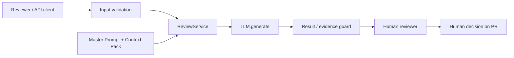

# ADR: ограниченный LLM-помощник для review одного PR

- Статус: proposed
- Дата: 2026-09-20
- Ответственные: разработчик сервиса и человек-ревьюер

## Контекст

Текущий diff добавляет минимальный путь `POST /api/reviews` → `ReviewService.review` → `LLM.generate`. Prompt состоит из общей инструкции и пользовательского diff. Учебный кейс требует другого свойства результата: не больше трёх рисков, точное evidence и проверки, при этом решение всегда остаётся человеку.

Нужно выбрать архитектурную границу, при которой LLM помогает анализировать diff, но не получает лишних полномочий и не может незаметно заменить проверяемые факты предположениями.

## Критерии решения

| Критерий | Как понимаем в первом сценарии |
|---|---|
| Доказательность | Каждый риск можно связать с `file:line`, evidence и отдельной проверкой. |
| Минимальные полномочия | AI анализирует вход, но не approve/merge/edit и не получает лишние инструменты. |
| Проверяемость | Правила результата можно проверить unit/integration/E2E-тестами без реальной модели. |
| Соответствие scope | Решение работает для одного diff и не требует данных вне разрешённого Context Pack. |
| Простота первого инкремента | Добавляются только компоненты, необходимые для контракта review. |

## Решение

Для первого сценария используем **ограниченный review pipeline**:

1. API принимает один diff и проверяет входной контракт.
2. `ReviewService` не формирует свободный prompt сам, а получает Master Prompt + Context Pack с правилами результата.
3. LLM возвращает структурированный review: summary, максимум 3 риска, checks.
4. Результат проходит проверку формата и наличия evidence.
5. Человек видит предложение и самостоятельно принимает решение по PR.

LLM не получает права менять код, выполнять shell-команды, approve или merge. Доступ к полному репозиторию для первого сценария не требуется.

## Контракт компонентов

| Компонент | Ответственность | Не отвечает за |
|---|---|---|
| Input Guard | Проверить наличие и форму входного diff до вызова модели | Семантическое качество review |
| ReviewService | Собрать разрешённые входы и оркестрировать один review | Самостоятельное решение approve/merge |
| Master Prompt + Context Pack | Задать правила, формат, evidence и границы задачи | Данные, которых нет в разрешённых источниках |
| LLM | Сформировать предложение review по переданному контракту | Изменение кода и финальное решение по PR |
| Result Guard | Проверить структуру, лимит рисков и наличие обязательных полей | Определение истинности бизнес-требований вне Context Pack |
| Human Reviewer | Проверить evidence и принять/отклонить замечания | Слепое принятие ответа модели |

Инварианты границы Human/AI:

1. Любое действие над PR остаётся за человеком.
2. Результат без проверяемого evidence не считается готовым review независимо от уверенности модели.

## Проверенные утверждения и открытые вопросы

| Утверждение | Статус | Основание |
|---|---|---|
| Текущий endpoint передаёт `payload["diff"]` в `ReviewService.review` | AS IS fact | `TRAINING_PR.diff`, `app/api.py` |
| Текущий `ReviewService` вставляет diff прямо в строковый prompt и возвращает `comment` | AS IS fact | `TRAINING_PR.diff`, `app/review_service.py` |
| Input Guard и Result Guard должны появиться в первом целевом pipeline | TO BE decision | Метрики evidence/check coverage и acceptance criteria из `problem.md`/`product_management.md` |
| AI возвращает не больше трёх рисков с evidence и checks | Правило кейса | `README.md` → «Задача помощника» |
| Требуются auth, rate limit, конкретный SLA или persistent storage | Unknown | В разрешённых источниках требования нет |

Input Guard и Result Guard далее описываются как **целевые компоненты**, а не как уже реализованные части `TRAINING_PR.diff`.

## Рассмотренные альтернативы

| Альтернатива | Доказательность | Минимальные полномочия | Проверяемость | Fit для одного diff | Сложность первого инкремента |
|---|---|---|---|---|---|
| A. Raw prompt + LLM | Низкая: evidence не обязателен | Высокая | Низкая: свободный текст | Высокий | Низкая |
| B. Bounded pipeline с Context Pack и Result Guard | Высокая: evidence часть контракта | Высокая | Высокая: структура валидируется отдельно | Высокий | Средняя |
| C. Tool-using agent с доступом к репозиторию | Потенциально высокая | Низкая: больше данных и действий | Средняя: больше состояний и инструментов | Низкий для текущего scope | Высокая |

Шкала качественная и относится только к первому use case: для первых четырёх критериев `высокая` означает лучшее соответствие критерию; для сложности, наоборот, `низкая` означает меньшую стоимость первого инкремента. Оценки используются для сравнения вариантов, а не как измеренные production-метрики.

**Выбор:** вариант B. Он добавляет ровно те механизмы, которые нужны метрикам evidence/check coverage и human-in-the-loop, но не расширяет задачу до автономного агента. Ограничение варианта B — качество семантического анализа всё ещё зависит от модели, поэтому Result Guard проверяет контракт, а истинность замечания в итоге подтверждает человек.

## Источники решения

| Источник | Что подтверждает | Тип |
|---|---|---|
| [`TRAINING_PR.diff`](TRAINING_PR.diff) | AS IS: endpoint, прямой `payload["diff"]`, строковый prompt, вызов `LLM.generate`, ответ `comment` | Факт текущего кода |
| [`README.md`](README.md#задача-помощника) → «Задача помощника» | ≤3 рисков, evidence/checks, решение остаётся человеку, запрет approve/merge/edit | Правило учебного кейса |
| [`problem.md`](problem.md#метрики) | Evidence coverage, Check coverage, Unsupported claims, соблюдение формата | Цели/метрики |
| [`product_management.md`](product_management.md#user-stories-и-acceptance-criteria) | Первый use case и acceptance criteria | Требования первого сценария |
| [`tests_unit.md`](tests_unit.md), [`tests_integration.md`](tests_integration.md), [`tests_e2e.md`](tests_e2e.md) | Способы проверить контракт и границы pipeline | Проверки TO BE решения |
| [`tests_load.md`](tests_load.md) | Performance-порогов из входа нет; нагрузочные числа используются только как characterization profile | Ограничение интерпретации результатов |

Внешние источники и общие best practices не используются как доказательство требований этого ADR.

## Последствия и главный риск

- **Положительные последствия:** результат легче проверить; одна и та же структура используется в тестах; границы AI видны из контракта.
- **Ограничения:** модель всё ещё недетерминирована; по одному diff нельзя доказать требования, которых нет в Context Pack.
- **Главный риск:** правдоподобное, но неподтверждённое замечание может выглядеть убедительно для человека.
- **Как проверим риск:** каждый возвращённый риск обязан иметь `file:line`, evidence и отдельную проверку; всё без evidence отклоняется.

## Verification gates

| Архитектурное правило | Связанное требование или риск | Где проверяем |
|---|---|---|
| В финальном review не больше трёх рисков | Format compliance | [`tests_unit.md`](tests_unit.md): validator с 4 risks; [`tests_e2e.md`](tests_e2e.md): позитивный сценарий |
| Каждый риск имеет `file:line`, evidence и check | Evidence/Check coverage | [`tests_unit.md`](tests_unit.md): risk без evidence; [`tests_e2e.md`](tests_e2e.md): ручная сверка результата |
| Diff не должен менять правила reviewer-а | Главный риск prompt injection / смешения инструкций и данных | [`tests_unit.md`](tests_unit.md): PromptBuilder; [`tests_e2e.md`](tests_e2e.md): instruction внутри diff |
| Исключение LLM не возвращается как успешный review | Ошибка провайдера не должна маскироваться под валидный результат | [`tests_integration.md`](tests_integration.md): fake LLM с `RuntimeError`; отдельно фиксируется поведение сервиса/API |
| Результат с нарушенным контрактом не проходит дальше | Роль Result Guard | [`tests_integration.md`](tests_integration.md): 4 risks / missing evidence |
| Валидный diff может дать 0 подтверждённых рисков | Лимит означает `0..3`, а не обязанность придумать замечание | [`tests_unit.md`](tests_unit.md): validator принимает 0 risks; [`tests_e2e.md`](tests_e2e.md): сценарий «Нет подтверждённых рисков» |
| Финальное решение остаётся человеку | Граница Human/AI | [`product_management.md`](product_management.md#user-stories-и-acceptance-criteria) + [`tests_e2e.md`](tests_e2e.md): результат только предлагается reviewer-у |

## Архитектурная схема

## Как использовали AI

- Для чего: в Практике 1 собрать исходное архитектурное решение, а в Практике 2 последовательно проверить его шестью техниками и сделать выбор воспроизводимым.
- Тип промпта: Master Prompt (P1); Few-shot, R.C.T.F., Chain of Verification, Tree of Thoughts, RAG и ReAct (P2).
- Журналы: [`prompts.md`](prompts.md) для P1 и [`../practice_02/prompts.md`](../practice_02/prompts.md) для P2.
- Что проверил студент и какие исправления поручил агенту: отделены AS IS / TO BE / Unknown, добавлены единые критерии альтернатив, локальные источники и verification gates; внешние best practices и лишняя инфраструктура отклонены как не подтверждённые текущим scope.
