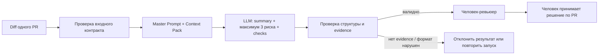

# Анализ процесса: AS IS и TO BE

## AS IS

Текущий технический путь из `TRAINING_PR.diff`:

1. Клиент вызывает `POST /api/reviews` и передаёт JSON.
2. `create_review` берёт `payload["diff"]` и вызывает `review_service.review`.
3. `ReviewService.review` формирует одну строку `Review this pull request and find problems:\n{diff}`.
4. Эта строка передаётся в `LLM.generate`.
5. Ответ LLM возвращается клиенту в `{"comment": answer}`.
6. Решение о качестве ответа и о самом PR остаётся за человеком, но код не задаёт LLM формального контракта evidence или ограничений результата.

Для процесса review это означает: модель получает diff, но без Context Pack сама выбирает число замечаний, критерии важности и степень доказательности.

## TO BE

Целевой процесс ограничивает LLM одной понятной задачей и оставляет решение человеку.

TO BE не требует давать модели доступ к merge, shell или изменению кода. Если риск нельзя связать с diff или разрешённым правилом, он не попадает в финальный список как подтверждённый.

## Разница

| Что меняется | AS IS | TO BE | Как проверим изменение |
|---|---|---|---|
| Контракт результата | Свободный текст LLM | Summary + максимум 3 риска + checks | Сверить структуру `P1-02` с Master Prompt v1 |
| Evidence | Не обязательно | Обязательно для каждого риска | Для каждого риска найти `file:line` и подтверждающий фрагмент diff |
| Работа с неизвестным | Модель может делать предположения | Неизвестные требования отделяются от дефектов | Проверить, что auth/rate limit не выданы за доказанный дефект без правила |
| Полномочия AI | В коде не формализованы | Только анализ; решение и действия — человеку | Проверить master prompt и отсутствие команд approve/merge/edit |
| Воспроизводимость | Зависит от свободного prompt | Один Context Pack, формат и Definition of Done | Повторить запуск на том же diff и проверить те же ограничения |

## Как использовали AI

- Для чего: описать текущую цепочку строго по diff и целевой процесс review без скрытого расширения полномочий AI.
- Тип промпта: master prompting.
- Строка в [`prompts.md`](prompts.md): `P1-03`.
- Что проверил студент и какие исправления поручил агенту: AS IS сверено построчно с diff; TO BE связан с требованиями Context Pack и измеримыми метриками из `problem.md`.
