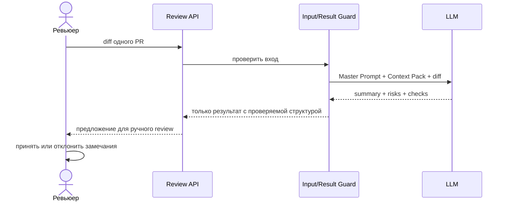

# Use cases и user stories

## Первый рабочий сценарий

**Когда** ревьюер передаёт diff одного PR, **система** запускает LLM с Master Prompt и ограниченным Context Pack, **а пользователь получает** краткое описание, максимум три доказанных риска и воспроизводимые проверки для ручного решения.

Не входит в этот сценарий:

- автоматический approve или merge;
- изменение файлов PR;
- поиск по репозиторию или web;
- выдача неизвестного требования за установленное правило проекта.

## Use case

| Поле | Значение |
|---|---|
| Актор | Человек-ревьюер |
| Триггер | Нужно предварительно проверить один PR по его diff |
| Предусловия | Есть unified diff; загружен Master Prompt и Context Pack; модель доступна |
| Основной результат | Summary, 0–3 риска с `file:line` + evidence + check, список проверок |
| Ошибка или отказ | Вход пуст/невалиден; модель нарушила формат; риск не подтверждается доступным источником |



## User stories и acceptance criteria

```gherkin
Feature: Evidence-based AI review одного PR

  Scenario: Валидный diff содержит проверяемый риск
    Given у помощника есть только TRAINING_PR.diff и Context Pack
    When ревьюер запускает review
    Then ответ содержит краткое описание изменения
    And содержит не более трёх рисков
    And каждый риск содержит file:line, evidence и конкретную проверку
    And финальное решение оставлено человеку

  Scenario: Возможное требование нельзя подтвердить входом
    Given во входе нет требования об аутентификации endpoint
    When модель рассматривает отсутствие аутентификации
    Then она не выдаёт его за подтверждённый дефект PR
    And при необходимости помещает его в список неизвестных требований

  Scenario: Результат нарушает контракт
    Given модель вернула риск без evidence или больше трёх рисков
    When система проверяет результат
    Then такой результат не считается готовым
    And человеку показывается причина нарушения контракта
```

## Как использовали AI

- Для чего: превратить требования кейса в один конкретный use case и проверяемые acceptance criteria.
- Тип промпта: master prompting.
- Строка в [`prompts.md`](prompts.md): `P1-03`.
- Что проверил студент и какие исправления поручил агенту: сценарии согласованы с `context.md`, `problem.md` и границами AI; критерии можно проверить без догадок о production-инфраструктуре.
