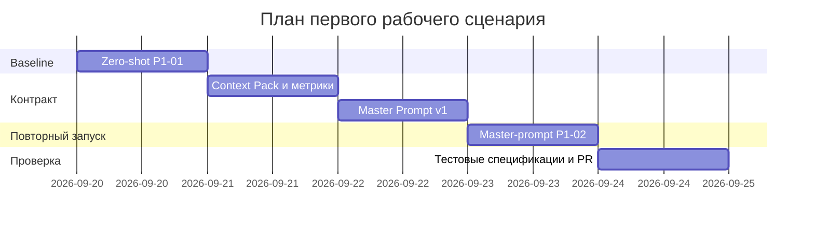

# План поставки

## Инкременты и ответственность

| Инкремент | Наблюдаемый результат | Что делает человек | Что делает AI или субагент | Проверка | Зависимости |
|---|---|---|---|---|---|
| 1. Baseline без контекста | Сохранён `P1-01` на одном `TRAINING_PR.diff`; видны пробелы короткого запроса | Проверяет, какие выводы доказаны diff, а какие являются предположениями | В отдельном изолированном запуске выполняет zero-shot review | Сверка `results/P1-01.md` с diff; фиксируются неподтверждённые claims и отсутствующие checks | Только `TRAINING_PR.diff` |
| 2. Контекст и контракт | Зафиксированы пользователь, проблема, метрики, Context Pack и Master Prompt v1 | Подтверждает факты, границы и неизвестные требования | Собирает связанные SDLC-артефакты из разрешённых источников | Ссылки на источники; отсутствие неизвестных требований среди фактов; `make step1` как структурная проверка | Инкремент 1 |
| 3. Повторный review | Сохранён `P1-02` на том же diff и той же задаче, но с Master Prompt v1 | Сравнивает P1-01/P1-02 и принимает или отклоняет замечания | В новом изолированном запуске выполняет review по зафиксированному контракту | ≤3 риска; у каждого `file:line`, evidence и check; границы AI соблюдены | Инкремент 2 |
| 4. Тестовый контур и PR | Unit/integration/load/E2E-спецификации согласованы с требованиями и ADR | Проверяет связность документов и финальный diff PR | Помогает сопоставить требования, архитектурные правила и проверки | Ручная перекрёстная сверка + `make install && make test` | Инкремент 3 |

## Диаграмма Ганта

## Как использовали AI

- Для чего: разбить работу на инкременты с наблюдаемым результатом и явным разделением ответственности человека и AI.
- Тип промпта: master prompting.
- Строка в [`prompts.md`](prompts.md): `P1-03`.
- Что проверил студент и какие исправления поручил агенту: порядок приведён к методике практики — сначала изолированный zero-shot baseline, затем контекст/master prompt, только после этого второй запуск; AI не назначен владельцем решений или merge.
